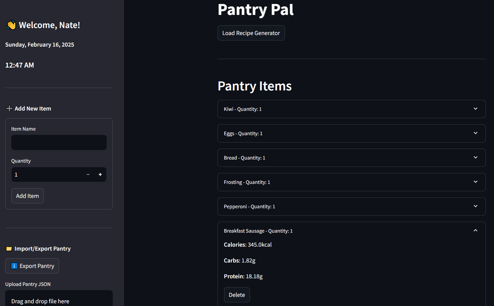
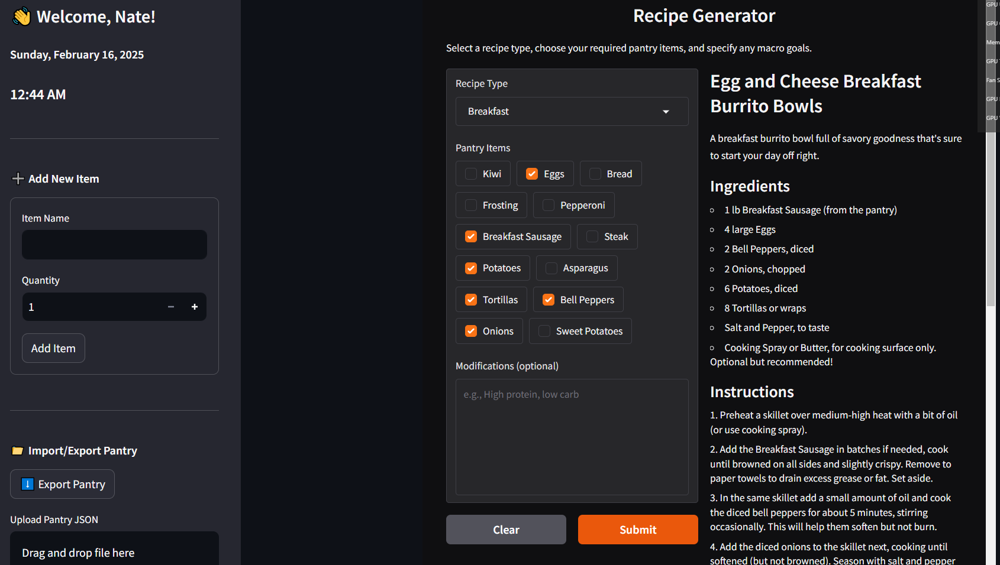
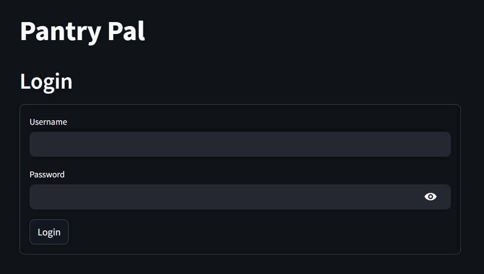

# PantryPal

## Overview
PantryPal combines three powerful systems to help you manage your kitchen and nutrition more effectively:

### 1. Smart Macro & Pantry Management 
<div align="center">
  
</div>

PantryPal provides comprehensive nutritional insights:
- 🔄 Real-time macro-nutrient calculations
- 📊 USDA FoodData Central integration
- 📱 UPC barcode scanning support
- 🔍 Smart ingredient auto-completion
- ⚖️ Per-serving nutritional scaling
- 📈 Full pantry nutritional analytics

### 2. AI-Powered Recipe Generation
<div align="center">
  
</div>

Intelligent meal planning system featuring:
- 🧠 Context-aware recipe suggestions
- 🎯 Macro-nutrient target optimization
- 🥗 Dietary restriction compliance
- 🔄 Dynamic serving size adjustments
- 🕒 Timezone-aware meal planning

### 3. Secure User Management
<div align="center">
  
</div>

Enterprise-grade security features:
- 🔐 JWT-based authentication
- 🔒 Secure token management
- ⏱️ Configurable session handling
- 🚫 Data isolation per user
- 🔑 Role-based access control

## Technical Overview

PantryPal is a microservices-based AI-powered kitchen management system that demonstrates modern software architecture and AI integration patterns. The system combines inventory tracking with intelligent recipe generation through Ollama LLM integration.

## Technical Architecture

PantryPal uses a modern microservices architecture with four key service layers:

```
+-------------------------PantryPal Architecture-------------------------+
|                                                                      |
|                        [Client Layer]                                |
|  +-------------+                                                     |
|  |  Streamlit  |    Real-time UI, Recipe Browsing, Inventory Mgmt    |
|  |     UI      |                                                     |
|  +------+------+                                                     |
|         |                                                            |
|         v                                                            |
|    [API Layer]        FastAPI Backend Services                       |
|  +-------------+     +--------------+    +---------------+           |
|  |   Auth &    |     |   Pantry &   |    |     AI &      |           |
|  |   Users     |     |   Inventory  |    |    Recipes    |           |
|  +-------------+     +--------------+    +---------------+           |
|         |                  |                    |                    |
|         v                  v                    v                    |
|    [Service Layer]    Core Business Logic                            |
|  +-------------+     +--------------+    +---------------+           |
|  | JWT Auth    |     | USDA Food    |    |   Ollama      |           |
|  | Sessions    |<--->| Data Central |<-->|   LLM Model   |           |
|  | User Mgmt   |     | API Client ↺|    |   Generation  |            |
|  +-------------+     +--------------+    +---------------+           |
|         |                  |                    |                    |
|         v                  v                    v                    |
|    [Storage Layer]    Persistent Data                                |
|  +--------------------------------------------------+                |  
|  |                   JSON Storage                     |              |
|  |  • Users  • Inventory  • Recipes  • Auth Sessions  |              |
|  +--------------------------------------------------+                |
|                                                                      |
+----------------------------------------------------------------------+

Flow:
→ HTTP/REST   ⇢ Internal Calls   ⇣ Data Access   ↺ Background Tasks
```

### Core Components

#### Authentication & Users
- JWT-based security
- Session management
- User data isolation

#### Pantry & Inventory
- USDA nutritional data
- Async macro processing
- Inventory tracking

#### AI & Recipes
- Ollama LLM integration
- Recipe generation
- Macro-aware planning

## Development Setup

### Prerequisites
- Node.js & npm
- Python 3.8+
- Docker & docker-compose (optional for containerized development)
- (Optional) expo-cli: `npm install -g expo-cli`

### Quick Setup Scripts
Use the platform script at the repo root to install dependencies for both API and UI:
```bash
# macOS/Linux
./setup.sh
```
```bat
:: Windows (cmd.exe)
setup.bat
```

After running the script, copy and configure your environment variables:
```bash
cp api/.env.example api/.env  # or create api/.env
# populate required keys:
PANTRY_TABLE_NAME=PantryPal
AUTH_TABLE_NAME=AuthTable
USDA_API_KEY=<your_usda_api_key>
OPENAI_API_KEY=<your_openai_api_key>
SECRET_KEY=<your_secret_key>
MACRO_QUEUE_URL=<your_sqs_macro_queue_url>
IMAGE_QUEUE_URL=<your_sqs_image_queue_url>
```

### Running Locally
```bash
# Start the FastAPI backend
cd api
source .venv/bin/activate        # Windows: .\.venv\Scripts\activate
uvicorn app:app --reload --port 8000

# Start the Expo (React Native) UI
cd ../expo/ppal
npm start
```

### Running with Docker
You can also spin up the whole stack via Docker Compose:
```bash
docker compose up
```
UI will be available at http://localhost:19002 (Expo DevTools), and API at http://localhost:8000

## Architecture Diagram

```
+----------------------------------------------------------------------------------------+
|                                     PantryPal System                                   |
+----------------------------------------------------------------------------------------+

+-------------+     +-------------+     +-------------+     +-------------+
|  Streamlit  |     |    Flask    |     |   FastAPI   |     |   OpenAI    |
|     UI      |<--->|      UI     |<--->|   Backend   |<--->|   AI Server |
|  Port:8501  |     |  Port:5000  |     |  Port:8000  |     |  Port:443   |
+-------------+     +-------------+     +-------------+     +-------------+
                                |
                                v
        +------------------------[API Routes]------------------------+
        |                                                            |
+-------------+  +---------------+  +------------------------+       |
|    /ai/     |  |  /inventory/  |  |      /recipes/         |       |
+-------------+  +---------------+  +------------------------+       |
        |               |                       |                    |
        v               v                       v                    |
+-----------+  +--------------+  +-------------------------+         |
|  Prompts  |  |  Item CRUD   |  |   Recipe Generation     |         |
+-----------+  +--------------+  +-------------------------+         |
        |               |                       |                    |
        +---------------+-----------------------+--------------------+
                                |
                                v
                        +------------------+
                        |  Data Storage    |
                        |  (JSON Files)    |
                        +------------------+

     [Data Flow]
     ---------->  HTTP/REST API Calls
     - - - - ->  Internal Service Communication


Key Features:
┌─────────────────────┐
│ • Async Processing  │
│ • LLM Integration   │
│ • Macro Tracking    │
│ • Recipe Gen        │
└─────────────────────┘
```

## Future Enhancements
- Custom model fine-tuning for recipe generation
- Enhanced nutritional analysis
- Multi-model AI pipeline
- Collaborative recipe development
- Advanced inventory optimization

